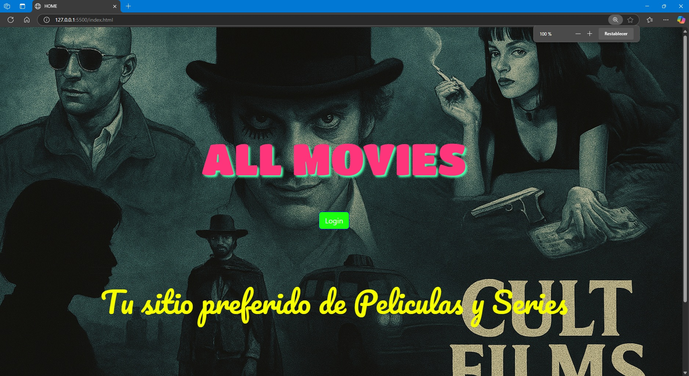
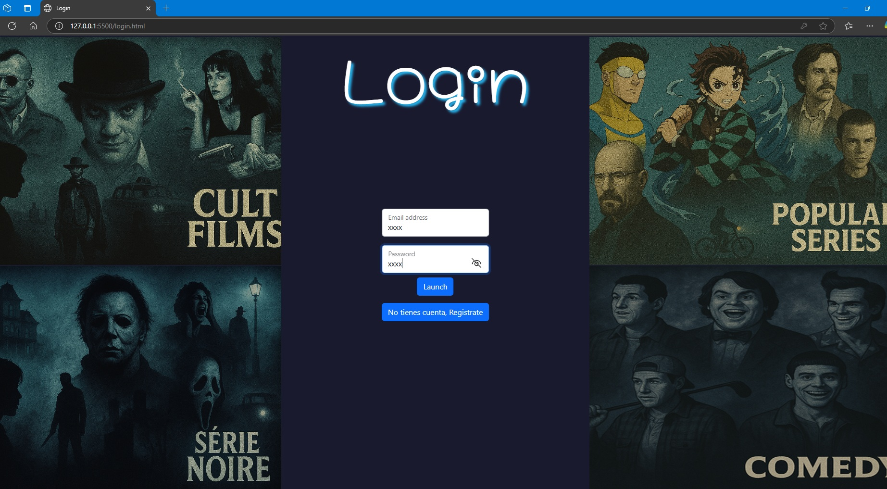
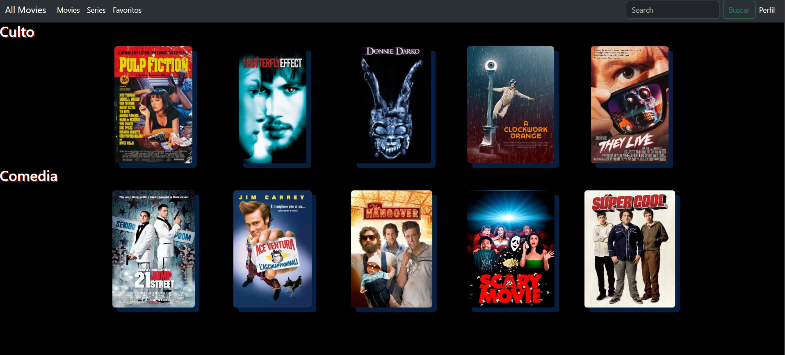
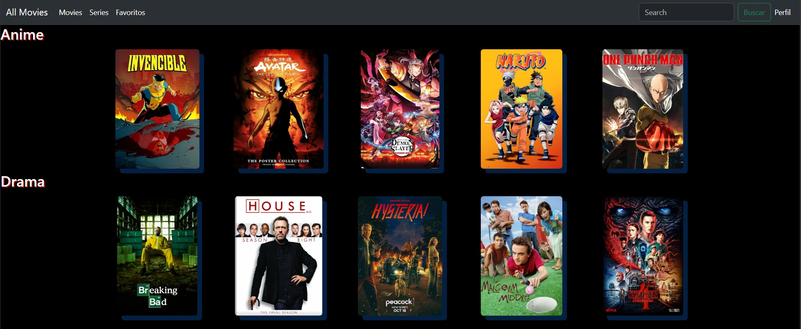
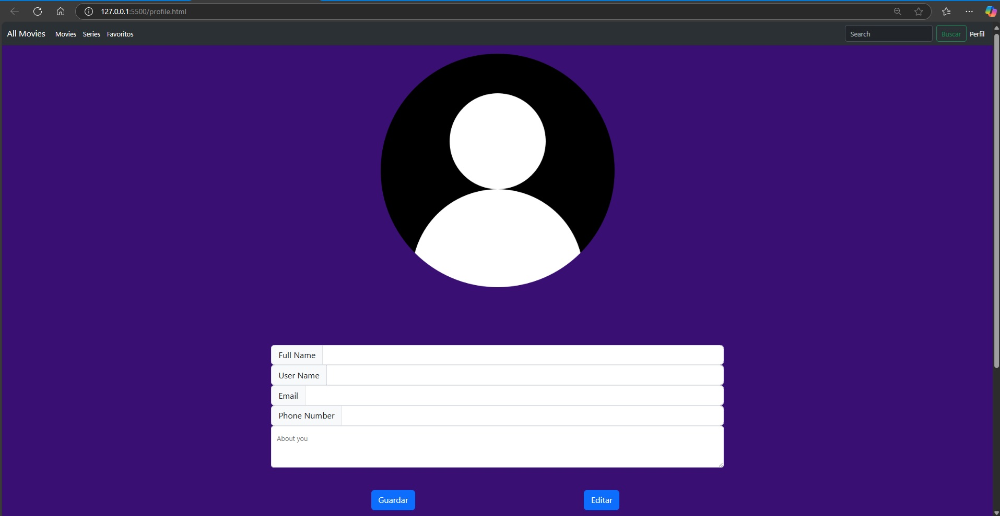

# SemilleroMega: Desarrollo de APP Web para un sitio de streaming 

---
##Owner: David Ricardo Cruz Juarez

###Objetivo: El objetivo de este repositorio es mostrar el avance en cada sprint adecuando el proyecto a las necesidades de los cursos impartidos por el Challenger.
Actualmente cubrimos el Sprint 5, Cada sprint se implemnetan diferentes funcionalidades y se agregan mas tecnologias.

## Contenido

*   [Sprint 1](#sprint-1)
*   [Sprint 2](#sprint-2)
*   [Sprint 3](#sprint-3)
*   [Sprint 4](#sprint-4)
*   [Sprint 5](#sprint-5)
*   [Retrospectiva](#retrospectiva)

---

### Sprint 1

Aquí puedes encontrar la información sobre la sección 1.

Sprint 1: La primer version del repositorio aplicando HTML, CSS y JS lo pueden encontrar en la siguiente liga

https://github.com/DavidRCJ/SemilleroMega.git

### 2. Requerimientos tecnicos - 
Esquema de baja fidelidad en Canva
Diagramda de Flujo en DrawIO para el funcionamiento de la interfaz
Desarrollado en Visual Studio Code con HTML, CSS y JS
### 3. ¿Como instalar?
Clonar el Repo en su pc en la terminal copiar el siguiente comando
      git clone https://github.com/DavidRCJ/SemilleroMega.git
### 4. Mockup de la aplicación
Un primer diseño, esta en Draw explica el Flujo de las pestañas

### 4. Capturas de pantalla - 5 capturas con explicacion
Para iniciar Abri el Index.html, y cargar el liveserver para entrar a la ventana de welcome

2.- Seleccionar Login

3.- Escribir usuario xxxx,password xxxx y presionar launch
4.- Esatras dentro de movies o series puedes interactuar con el navbar con Movies

    Series, puedes ver las series disponibles, por ahroa no pero talves en el futuro
    
    Perfil, permite agregar algunos datos
    
>>>>>>> f4176f54ed41cc0840480e4d722a02d7120070d3

Para cuando se permite entrar nos arroja a la pestaña de movies 

3.- Las ventanas que necesitan almacenar datos se les dio funcionalidad como la de perfil permitiendo gaurdar y alamcenar datos del usuario ademas de cambio de foto.
Se le dio La validación para almacenar campos hacemos uso del Local Storage, para almacenar datos del usuario además permite cambiar la imagen de usuario cuando pulsamos sobre ell. 

La interfaz presenta 3 botones, guardar, editar y sali.

El botón guardar: cuando los campos están vacíos permite guardar los datos.

El segundo botón editar permite editar los datos cuando ya se guardan los datos.

El botón salir nos permite salir a la pantalla inicial que es home.

---

### Sprint 2

En este sprint se adecuo la responsabilidad en cada pestaña y migración a angular y type script
/n

1.- Responsabilidad, como se puede observar en la imagen cada pantalla cuenta con la configuración para ser responisve almenos para pc y teléfonos

2.- Las funciones de los menús son funcionales se entregaron en el sprint 1, lo que procedió ahora es validar con JS las sesiones en este caso los inicios de sesión como el usuario y contraseña, 

Esta imagen muestra que si las credenciales no son correctas no permite entrar y muestra el siguiente mensaje, para logarse se ocupa:

User: user@mega.com
Password: mega2025

Para cuando se permite entrar nos arroja a la pestaña de movies 

3.- Las ventanas que necesitan almacenar datos se les dio funcionalidad como la de perfil permitiendo gaurdar y alamcenar datos del usuario ademas de cambio de foto.
Se le dio La validación para almacenar campos hacemos uso del Local Storage, para almacenar datos del usuario además permite cambiar la imagen de usuario cuando pulsamos sobre ell. 

La interfaz presenta 3 botones, guardar, editar y sali.

El botón guardar: cuando los campos están vacíos permite guardar los datos.

El segundo botón editar permite editar los datos cuando ya se guardan los datos.

El botón salir nos permite salir a la pantalla inicial que es home.

4.- Ahora se agrago un archivo llamado 'detalle.js' para mostrar la informacion correspondiente de cada pelicula o serie y al ser dinamica solo se crearon objetos en lugar de una base de datos que en el futuro se cambiara para almacenar mas stock de peliculas,
una vez en la seccion de peliculas o series al pulsar cualquier elemento lo arroja a este tipo de ventana:

5.- Ahora empezamos la migración necesitamos la version de Angular 18 instalada: 

Para poder la version en angular cree una carpeta dentro del repo Llamada semillero-Angular, y los archivos de la version 1 en la carpeta normal version.

Bueno creamos los packages para cada vista en el proyecto

Ahora procedemos a conectar HTML Y CSS de las diferentes vistas

Creamos cada  componente dentro de Pages donde estara cada vista que tenmos de html, las carpetas se ven de la siguiente forma:

Son lo modulos son con su componente HMLT,JS,CSS, pero tengo unas incosistencias en los paths o rutas dado que no lee imagenes, o no muestra la vista como debe ser ejemplo si solo ejecutop el html y luego de angular se ve asi

Ejmplo la pantalla de bienvenida del lado izquiero tenemos el la vista ejeuta desde angular y del otro solo de live sever del HTML ambos desde visual code.

Ahora despues de presionar el boton de login

Sigo en reparacion y consultando documentacion porqiue no puedo avanzar a la fase de testing del 3  sprint espro poder resolverlo en la semana. 

Puntos pendientes y logradps del 3 sprint

Puntos cubietos:
  Responisvidad
  Performance 40$

  
Puntos Faltantes:
  Implementacionde asincronos
  RXJS
  Testing

Continuando con la  migracion a angular y esta casi completa como se puede apreciar en estas imagenes

solo tengo un detalle con el componente detalle.component.html Cuando hago el llamado desde movies o series no me carga los datos de la pelicula entra a la pagina pero no carga elemetos

Puse un console log para ver si cargaba detalle. hmtl y si pero no carga elemntos como ya mencione al parecer creo que no me esta guardadno el id en el local storage y no me esta enlazando a la pagina correspondiente
Si pude observar en la parte de movies hago el llamdo con un boton que me redirecciona al metodo que verdetalle donde almaceno el ID y llamo al componente detalle, si vamos al html de detalle.component.html tiene los datos a caragar pero no refleja nada en la vista
sigo investigando como cargar esos estilos espero tenerlos para el fin de semana para completar el sprint 3

He completado la migracion a Angular V18, logranddo solucionar los problemas presentados de local Storage y muestra de contenido con css, el proble se presentaba en un a linea de Codigo de NGIF, V18 no la reconocia entonces se cambio por un div ahora tenemos este resultado, hicimos caso de no usar degradados y se opto por colores mas simple como se muestra a continuacion

---

### Sprint 3

Ahora procedemos a ejecutar los test cases del sprint 3, lo faltante que serian los puntos

Para el sprint 3 diseñamos ciertos test cases para storage

Anexo captura de la ejecucion en Karma Jasmine, de 12 test cases fallaron 3 pero esta ecelente porque esos botones de agregar y eliminar aun no estan definidos

Ahora anexo captura del Code Coverage

Con esto damos por entregada el Sprint 3 cubriendo todos los puntos reqeuridos 

Puntos cubietos:
  Responisvidad
  Performance 40$
  Implementacionde asincronos
  RXJS
  Testing

Ahora solo falta implementar SPRINT 4 
  Falta los siguientes puntos
  T-SQL/     LOGIN CON DB/    Consumo de la Base de datos /    Seguridad de Login

---

### Sprint 4

Puntos a cubrir en este Sprint

Implementacion de Lazzy Loading

En esta entrega se realizo leazzy loading en la pagina principal de carga dado que los demas elementos son individuales entonces no tendria mas que implementar, ademas se implemento el AuthGuard para validar el login en las demas vistas
como se aprecia en la imagen

Seguridad de login

Por ahora como tuve probelas con la base de datos mejor dicho el entorno de SQLMSS y la vinvulacion por esta ocasion entrego una cifrado BASE64 que para la otre tengo penado implementar SHA254

Punto pendientes 

TSQL

Login con DB

Consumo de la base de datos

Como se muestra en la imagen, para iniciar con SQL  instale la version  SQLMS V21 como se muestra en la imagena ademas de instalar el server SQL Developer para corre la DB pero se mostro estre problema

Se trato de instalar otros servers como la base o la Express pero no se obtubo respuesta alguna, para ello decidi bajar de version a la V20.2.1 la cual obtuve mejor respuesta como se aprecia en la imagen ahroa solo falta empezar los scripts para poder implementar y hacer consumo de DB

---

### Sprint 5

Aquí puedes encontrar la información sobre la sección 5.

---

### Retrospectiva

¿Que hice bien?
La implementacion de Lazzy Loading y el Auth Guard algo basico para esta entrega pero cumple con el requerimiento

¿Que no salio bien?
La creacion y uso del SQLMSS tarde varios dias en resolver ese problema, cuando se encuetra la solucion se descansa un poco 

¿Que puedo hacer diferente?

La implementacion de la DB para poder consumir y usar DB
---

